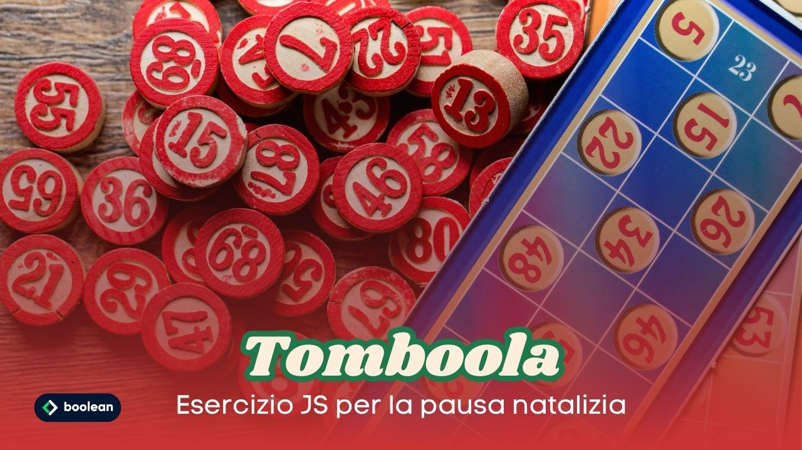

 
Esercizio Natalizio Classe #137 - Boolean

---

Studente: Fabio Ferrero

---
# English

## Target of the project:
Reconstruct the scoreboard and bingo features, with the drawing of numbers and subsequent illumination of the numbers drawn! 

---
# Italiano

## Obiettivo del progetto:
Ricostruire il tabellone e le funzionalità della tombola, con l’estrazione dei numeri e conseguente illuminazione dei numeri estratti! 

---

